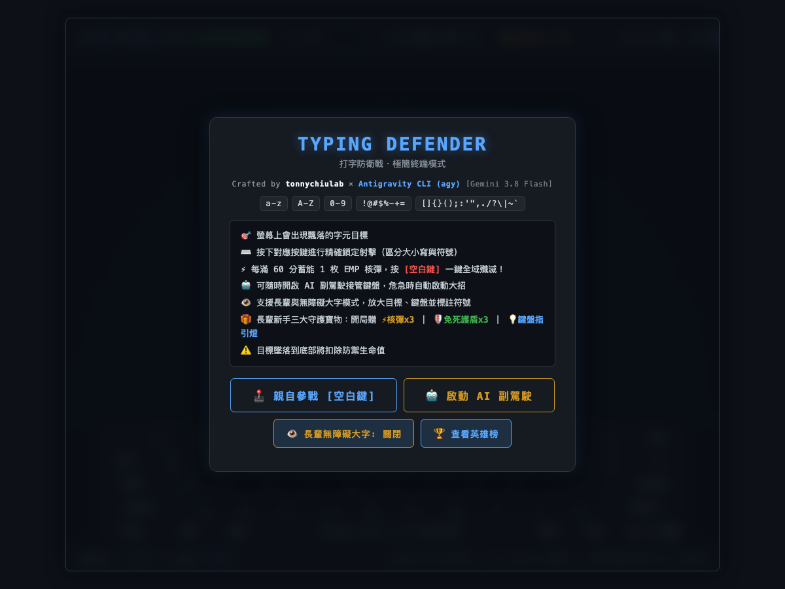
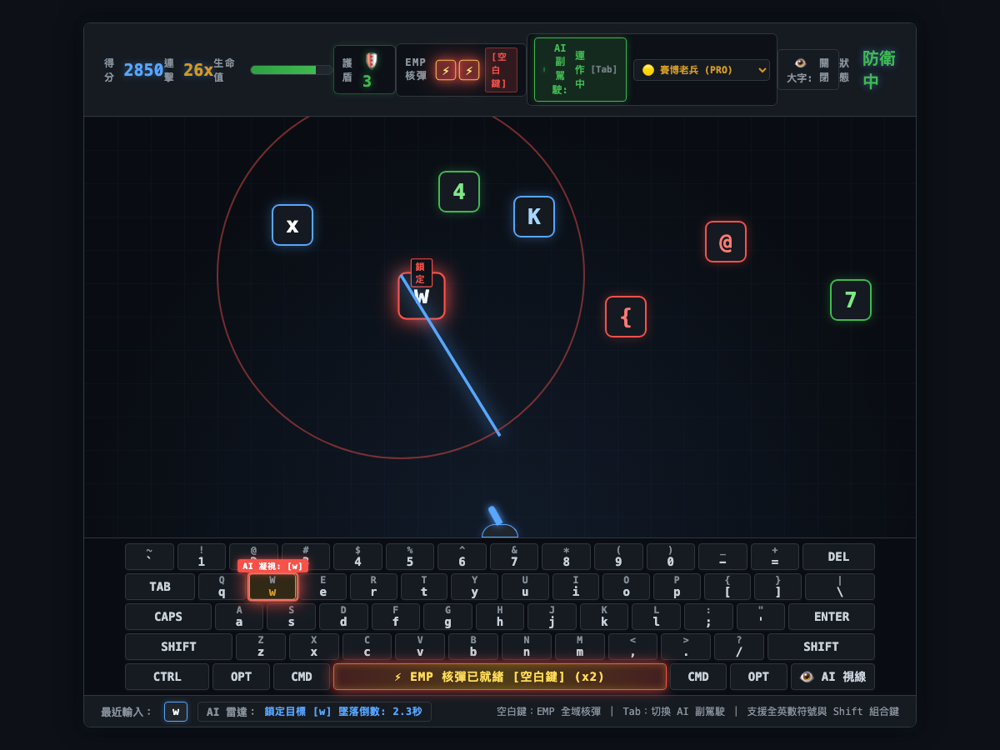

# ⚡ Typing Defender (HTMX + Cyber AI Pilot)

> 極簡終端風格、零外部資源依賴的打字射擊防衛遊戲，整合 HTMX 即時排行榜與自走 AI 視覺凝視副駕駛系統。


[](https://tonnychiulab.github.io/typing-shooter-htmx/)

### 🌐 線上即玩（Play Online Now）
👉 **[https://tonnychiulab.github.io/typing-shooter-htmx/](https://tonnychiulab.github.io/typing-shooter-htmx/)**
*(免安裝任何環境，打開瀏覽器即可直接親自參戰或觀看 AI 自主作戰！)*

---

## 📸 遊戲畫面（Screenshots）

| 1. 開始選單（Start Screen） | 2. 實時作戰與 AI 視覺凝視（Live Combat） |
| :---: | :---: |
|  |  |
| *極簡終端介面、字元庫支援與手動/AI模式選單* | *雷射連擊射擊、字母目標掉落、實體虛擬鍵盤與 AI Gaze 鎖定* |

---

## 🎮 遊戲特點

1. **極致輕量與零外部音訊/圖片依賴**
   - 使用 **Web Audio API** 振盪器動態合成雷射、爆炸與警報音效。
   - SVG 動態渲染高能雷射光束與砲台轉向。

2. **全鍵盤字元盲打挑戰**
   - 包含小寫 `a-z`、大寫 `A-Z`、數字 `0-9` 以及所有鍵盤標準與特殊符號（`!@#$%^&*()-_=+[]{};:'",./?\|~``）。
   - 依據高度與下落速度實時計算威脅度，優先射擊最靠近防線的目標。

3. **HTMX 深度整合全球排行榜**
   - 純 Node.js 原生零依賴後端伺服器（免 `npm install` 任何外部套件即可直接啟動）。
   - 伺服器端渲染 Top 10 排行榜 HTML 片段，透過 HTMX 無刷新置換並動態高亮玩家最新戰績。

4. **🤖 自主 AI 模型副駕駛（Auto-Pilot）與視覺虛擬鍵盤**
   - 提供 3 種 AI 模型人格：
     - 🟢 **ROOKIE BOT**：新手模型（反應 220～320ms，88% 命中率，模擬手滑誤鍵）
     - 🟡 **CYBER PRO**：老兵模型（反應 90～150ms，98% 命中率）
     - 🔴 **AGI GOD**：神級機魂（反應 30～55ms，100% 絕對精準，極速雷射暴雨）
   - **實體 60% 終端機虛擬鍵盤**：AI 決策時眼球瞄準準星（`AI GAZE`）在鍵盤上即時跳躍掃描，遇大寫/特殊符號自動激發 <kbd>Shift</kbd> 藍光並下壓按鍵！
   - 戰鬥中隨時按 <kbd>Tab</kbd> 鍵在玩家手動與 AI 接管之間無縫切換。

5. **⚡ 階段獎勵：EMP 全域殲滅核彈（Omni-Laser EMP Burst）**
   - **充能機制**：每累計獲得 **60 分** 即蓄滿 1 枚 EMP 核彈（最多庫存 2 枚，HUD 顯示 `[⚡][⚡]`）。
   - **一鍵解危**：按 <kbd>Space</kbd>（空白鍵）即刻引爆，全場雷射齊發 + 同心電磁震波橫掃，瞬間清空滿屏字母！
   - **沉浸回饋**：蓄能完畢時空白鍵進入流光跑馬燈狀態，搭配 Web Audio 原生合成的低頻下潛重低音。
   - **AI 副駕駛自主決策**：在 AI 巡航狀態下，遇場上目標過多或危急逼近防線時，AI 會自動拍下大招核彈化解危機。

6. **👁️ 長輩友善與無障礙大字模式（Senior & A11y Accessibility Mode）**
   - **一鍵切換**：頂部 HUD 與開場選單設有 `👁️ 大字模式 [開啟 / 關閉]` 切換開關，偏好設定自動持久化儲存。
   - **全域字級躍升（WCAG AAA 高對比）**：
     - 下落字元節點放大至 **`64px` 巨幅框體** 與 **`2.3rem` 超大加粗字體**，夜間與弱視辨識極度清晰。
     - 虛擬鍵盤主按鍵放大至 **`17px`**、次要 Shift 符號放大至 **`14px 亮金高對比色`**。
   - **難辨符號防呆中文標籤**：針對長輩易混淆的微小標點（如 `,` 逗號、`.` 句點、`;` 分號、`:` 冒號、`'` 單引、`"` 雙引、`~` 波浪），目標球自動附加中文註釋標籤，杜絕誤按！
   - **動態視力減壓**：開啟時下落初速自動提供 15% 溫和微調，體貼長輩即時神經反應與手眼協調。

7. **🎁 長輩初學三大守護寶物（Zero-Frustration Starter Treasures）**
   - 專為長輩剛練習打字量身打造，開啟無障礙模式時**開局即自動獲得三大保命寶物**：
     - ⚡ **寶物一：滿裝 3 枚 EMP 保命核彈**（開場直接擁有 3 發全清底牌，遇字堆積按空白鍵立刻救命）。
     - 🛡️ **寶物二：3 層失誤免死護盾**（前 3 次漏字碰底由護盾 100% 吸收，扣 0 HP，守護老人家血條）。
     - 💡 **寶物三：鍵盤智慧按鍵指引燈**（離底部最近的最危險字母，在虛擬鍵盤上自動發出綠色呼吸導引光）。

---

## 🚀 快速開始

### 1. 啟動遊戲本體

不需要安裝任何 npm 依賴套件，只需安裝好 Node.js（v18+）：

```bash
# 啟動伺服器
npm start
# 或直接執行
node server.js
```

打開瀏覽器前往：
👉 **`http://localhost:3000`**

- 點擊 **「🕹️ 親自參戰」** 或按空白鍵開始。
- 點擊 **「🤖 啟動 AI 副駕駛」** 派遣 AI 駕駛出征。
- 戰局結束後輸入呼號，透過 HTMX 將戰績登錄全球排行榜！

---

### 2. 終端機無頭 AI 錦標賽（CLI 跑分）

想在無瀏覽器環境下直接跑 AI 錦標賽並登錄成績：

```bash
# 預設老兵模型 (CYBER PRO) 參賽
npm run bot

# 或指定派出神級機魂 (AGI GOD) 衝擊榜首：
node run-ai-match.js god

# 或派出新手輔助機 (ROOKIE BOT)：
node run-ai-match.js rookie
```

---

### 3. 執行全自動化測試

專案已內建完整的端到端虛擬 DOM 測試與戰鬥物理模擬：

```bash
npm test
```

---

## 📁 檔案架構

```text
typing-shooter-htmx/
├── assets/
│   ├── screenshot-start.png    # 開始選單畫面截圖
│   └── screenshot-gameplay.png # 遊戲進行與 AI 戰鬥畫面截圖
├── index.html                  # 遊戲主介面、HUD、虛擬鍵盤基座、HTMX 容器
├── style.css                   # 賽博龐克暗黑終端風格、動效、虛擬鍵盤與鎖定樣式
├── game.js                     # 遊戲主引擎、砲台旋轉、Web Audio 音效、AI 威脅演算法
├── server.js                   # 原生 Node.js 靜態檔案伺服器與 HTMX 排行榜 API
├── scores.json                 # 伺服器持久化戰績資料庫
├── test-simulation.js          # 14 項核心機制自動化測試套件
├── test-live-battle.js         # 多波次連續戰鬥物理模擬測試
├── run-ai-match.js             # CLI 無頭 AI 錦標賽對戰腳本
├── package.json                # 專案設定與 NPM 腳本
└── README.md                   # 專案說明文件
```

---

## 👥 作者與致謝（Authors & Credits）

本專案由人類工程師與 AI Agent 共同結對（Pair Programming）合作設計、全端實作、資安審查與部署完成：

- 👤 **[tonnychiulab](https://github.com/tonnychiulab)** - 專案發起、架構決策、遊戲機制規劃與產品監督
- 🤖 **Antigravity CLI (`agy`)** - 全自主全端架構、HTMX 事件整合、賽博虛擬鍵盤、AI 視覺凝視系統與資安加固
  - **核心驅動模型**：`Gemini 3.8 Flash`
  - **開發工具**：Google Antigravity CLI (`agy`)

---

## 📜 授權協議

MIT License.
