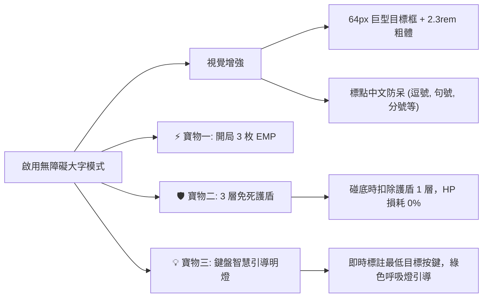
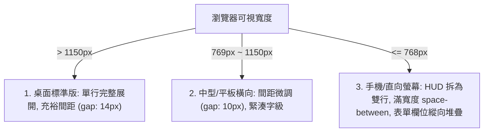

# 系統軟體設計說明書 (Software Design Document - SDD)

## 專案名稱：Typing Defender (HTMX + Cyber AI Pilot)
- **文件版本**：v1.2.0
- **制訂日期**：2026-09-18
- **作者／架構師**：tonnychiulab × Antigravity CLI (`agy`) [Gemini 3.8 Flash]
- **專案儲存庫**：`https://github.com/tonnychiulab/typing-shooter-htmx.git`
- **線上體驗**：[GitHub Pages 部署站點](https://tonnychiulab.github.io/typing-shooter-htmx/)

---

## 1. 系統概述與設計哲學 (System Overview & Philosophy)

### 1.1 系統定位
Typing Defender 是一款將「極簡賽博終端風格」與「高互動打字防禦機制」相結合的 Web 應用系統。系統融合全鍵盤標準字元盲打挑戰、三段式自主 AI 副駕駛（Auto-Pilot）視覺凝視系統、原生 HTMX 伺服器片段渲染排行榜，以及專為高齡長輩量身設計的無障礙大字與三大守護寶物。

### 1.2 設計哲學與原則
1. **零外部資源依賴 (Zero External Assets)**：
   - 全面摒棄外連字型、外部 MP3/WAV 音效檔與第三方圖檔。
   - 所有音效皆由瀏覽器原生 **Web Audio API** 振盪器（Oscillator）即時合成。
   - 所有動態雷射、砲台旋轉與視覺光效均由原生 **SVG + Canvas + CSS3** 繪製。
2. **極致輕量伺服器架構 (Zero NPM Dependencies)**：
   - 後端完全基於 Node.js 核心庫（`node:http`, `node:fs`, `node:path`），完全不需 `npm install` 任何第三方套件即可秒級啟動。
3. **事件驅動與超媒體架構 (HTMX-Driven Hypermedia)**：
   - 捨棄肥大前端單頁應用框架，透過 HTMX 接收自訂事件並以 HTML 片段完成局部無刷新更新與高亮動畫。
4. **包容性與長輩無障礙設計 (Universal Accessibility & Zero Frustration)**：
   - 遵循 **WCAG 2.1 AAA** 規範，提供大字號模式、微標點正體中文防呆註釋，並在開局預設配發 3 大保命寶物（3 發全清核彈、3 次免死護盾、鍵盤智慧引導明燈），大幅降低初學挫折感。
5. **模組化與自適應排版 (Responsive & Non-Squeezing Layout)**：
   - 透過嚴格的防擠壓 CSS 架構（`white-space: nowrap`, `tabular-nums`）與雙群組 Flexbox，確保從寬螢幕、平板到智慧型手機均保持清晰、無文字直向折行。

---

## 2. 系統架構與通訊模型 (System Architecture)

### 2.1 系統總體架構圖 (Mermaid C4 Architecture)

```mermaid
flowchart TB
    subgraph Browser ["客戶端瀏覽器 (Client-Side Browser)"]
        subgraph UI ["介面層 (Presentation Layer)"]
            HUD["頂部 HUD 狀態列 (戰況組 / 控制項組)"]
            GameArea["主作戰區域 (SVG 雷射 / 掉落字元節點)"]
            VKey["60% 賽博機械虛擬鍵盤 (AI 凝視 / 引導燈)"]
            Modal["選單 / 結算 / 排行榜浮層"]
        end
        
        subgraph Engine ["遊戲與駕駛引擎 (Engine Layer)"]
            GameCore["GameCore (狀態機 / 循環排程 / 碰底判定)"]
            AIEngine["AIPilot (威脅評估 / 延遲模擬 / 按鍵射擊)"]
            AudioCore["WebAudioEngine (振盪器音效即時合成)"]
            A11yCore["A11yManager (字級放大 / 護盾 / 導引光)"]
        end
        
        subgraph HTMXLayer ["超媒體通訊層 (HTMX / DOM Events)"]
            HTMX["HTMX 執行庫 (自訂事件觸發 / HTML 片段置換)"]
        end
    end

    subgraph Server ["原生 Node.js 伺服器 (Server-Side)"]
        HTTPRouter["原生 HTTP 請求分發器 (node:http)"]
        StaticServer["靜態資產處理模組 (MIME / 文件快取)"]
        ScoreAPI["排行榜 API (/api/score, /api/leaderboard)"]
        ScoreDB[("JSON 檔案持久層 (scores.json)")]
    end

    %% 連線關係
    GameCore -->|驅動渲染| GameArea
    GameCore -->|更新數值| HUD
    GameCore -->|觸發音效| AudioCore
    AIEngine -->|分析威脅| GameCore
    AIEngine -->|高亮凝視| VKey
    A11yCore -->|注入保護與導引| GameCore
    A11yCore -->|引導鍵位| VKey
    
    GameCore -->|dispatch HTMX 自訂事件| HTMX
    HTMX -->|POST /api/score (HTML)| ScoreAPI
    ScoreAPI -->|讀寫排行榜| ScoreDB
    ScoreAPI -->|回傳渲染後的 HTML 片段| HTMX
    HTMX -->|DOM 置換 & 高亮| Modal
    HTTPRouter --> StaticServer
    HTTPRouter --> ScoreAPI
```

### 2.2 前後端通訊協定 (Communication & API Specifications)

| 端點路徑 | 傳輸方法 | 請求載荷 (Payload) | 回傳型態 | 職責說明 |
| :--- | :--- | :--- | :--- | :--- |
| `/` | `GET` | 無 | `text/html` | 傳回遊戲主入口網頁 `index.html`。 |
| `/style.css`, `/game.js` 等 | `GET` | 無 | `text/css`, `text/javascript` | 靜態資源響應，支援標準 MIME 映射。 |
| `/api/leaderboard` | `GET` | 無 | `text/html` (Fragment) | 伺服器端渲染 Top 10 排行榜 Table 片段。 |
| `/api/score` | `POST` | `application/x-www-form-urlencoded`<br>`name=...&score=...&maxCombo=...&accuracy=...` | `text/html` (Fragment) | 驗證呼號防 XSS，寫入 `scores.json`，傳回包含最新戰績高亮（`.highlight-row`）的表格片段。 |

---

## 3. 模組詳細設計 (Detailed Component Design)

### 3.1 遊戲核心引擎 (`GameCore`)
- **生命週期管理**：維護狀態機（`IDLE` $\to$ `PLAYING` $\to$ `PAUSED` $\to$ `GAME_OVER`）。
- **目標生成演算法 (`spawnTarget`)**：
  - 目標字元集覆蓋：小寫字母（`a-z`）、大寫字母（`A-Z`）、數字（`0-9`）、特殊符號（`!@#$%^&*()-_=+[]{};:'",./?\|~``）。
  - 下落速度：基準速度配合波次遞增 $V(t) = V_{base} \times (1 + \text{score} \times 0.0008)$。
  - 在長輩無障礙模式下提供 15% 溫和微調減壓。
- **砲台指向與雷射流光**：
  - 根據擊發目標中心點座標 $(x, y)$，由砲台底座 $(x_{base}, y_{base})$ 動態計算角度：
    $$\theta = \arctan2(y - y_{base}, x - x_{base}) \times \frac{180}{\pi} + 90^\circ$$
  - 觸發 SVG 暫態高能射線，歷時 120ms 漸隱。

### 3.2 自走 AI 副駕駛系統 (`AIPilot`)

#### 3.2.1 威脅度評估演算法 (Threat Prioritization)
AI 每幀掃描螢幕上所有現存目標，計算綜合威脅值：
$$\text{Threat} = \frac{Y_{pos} + (V_y \times 1.5)}{\text{DistanceToTarget} + 1}$$
優先鎖定最迫近防守底線之危急目標。

#### 3.2.2 三大人格模型參數表

| 參數維度 | 🟢 新手模型 (ROOKIE) | 🟡 老兵模型 (VETERAN) | 🔴 神級機魂 (GOD) |
| :--- | :--- | :--- | :--- |
| **反應延遲區間** | $220 \sim 320\text{ ms}$ | $90 \sim 150\text{ ms}$ | $30 \sim 55\text{ ms}$ |
| **射擊命中率** | $88\%$（模擬 $12\%$ 手滑按錯鍵） | $98\%$ | $100\%$ 絕對命中 |
| **虛擬凝視掃描** | 慢速巡弋，輕微抖動 | 精準切換，平滑跟隨 | 瞬間跳躍，瞬殺鎖定 |
| **EMP 自主決策** | 目標 $\ge 6$ 顆或碰底前 $1.2\text{s}$ | 目標 $\ge 4$ 顆或碰底前 $1.8\text{s}$ | 零容錯危機自主引爆 |

#### 3.2.3 視覺化凝視與虛擬鍵盤連動 (Visual Gaze & Keystroke)
- 當 AI 鎖定某字元時，在目標頂部動態生成 `AI 凝視: [字元]` 呼吸準星。
- 同時在 60% 終端機虛擬鍵盤上：
  1. 對應實體鍵位觸發 `.vkey-gaze`（霓虹邊框高亮）。
  2. 若目標為大寫字母或次要 Shift 符號，虛擬鍵盤左/右 <kbd>Shift</kbd> 鍵同步點亮 `.vkey-active-shift`。
  3. 模擬真實按壓狀態 `.vkey-active`，完成視覺同步。

### 3.3 ⚡ EMP 全域殲滅核彈系統 (`EMPSystem`)
- **能量累積**：得分每增加 60 分充能 1 枚，最大容量 2 枚（長輩開局為 3 枚）。
- **引爆行為**：
  1. Web Audio 啟動低頻 50Hz 鋸齒波並進行頻率下潛調製，產生爆炸重低音。
  2. 畫面中央激發雙層同心圓擴散衝擊波（CSS 漣漪動畫）。
  3. 砲台向場上所有存活目標並行發射高密度多重雷射。
  4. 瞬間清場，計入擊破分數但不中斷連擊計數。

### 3.4 👁️ 長輩無障礙與三大守護寶物 (`A11y & Treasures`)



1. **視覺強化 (WCAG AAA)**：
   - 目標節點擴充至 `64px`，文字放大至 `2.3rem`（900 加粗）。
   - 易混淆微小符號（如 `,`, `.`, `;`, `:`, `'`, `"`, `~`）自動附帶正體中文說明小標記（例：`[逗號]`）。
2. **寶物一：滿裝 3 枚 EMP 保命核彈**：長輩開局免等待充能，即刻擁有 3 發全清王牌。
3. **寶物二：3 層失誤免死護盾**：
   - 遭遇字母觸底時，優先扣除護盾計數（HUD 顯示 `🛡️ x`），防守生命值不減扣，並播放專屬護盾吸收音效。
4. **寶物三：鍵盤智慧引導明燈 (Keyfinder Guide Light)**：
   - 實時偵測當前距離底線最近的最危險字元。
   - 在虛擬鍵盤上為該鍵注入 `.vkey-guide-urgent` 高亮綠色呼吸光暈。
   - 若為大寫或 Shift 組合符號，<kbd>Shift</kbd> 鍵同步發光引導長輩雙手協同操作。

---

## 4. UI/UX 響應式佈局與防擠壓架構 (Responsive Architecture)

### 4.1 頂部 HUD 雙群組防擠壓設計 (Dual-Group HUD Architecture)

為根治因項目過多造成的中文字元直向強制折行（例如 `得\n分`、`連\n擊`）：
1. **DOM 結構拆分為兩大功能群組**：
   - `.hud-stats-group`（戰況數據群）：得分、最高連擊、生命條、護盾、EMP 核彈庫存。
   - `.hud-controls-group`（操作控制項）：AI 狀態與切換開關、難度模型下拉選單、大字無障礙按鈕、準備狀態。
2. **核心 CSS 規則強制鎖定**：
   ```css
   .hud-item {
       display: inline-flex;
       align-items: center;
       gap: 6px;
       white-space: nowrap; /* 核心防擠壓：標籤文字絕不折行 */
       flex-shrink: 0;
   }
   .hud-value {
       font-variant-numeric: tabular-nums; /* 等寬數字對齊，防止數字跳動抖動 */
   }
   ```
3. **精簡標籤冗詞**：
   - `生命值` $\to$ `生命`（血條寬度由 120px 調校為 80px）。
   - EMP 文字精簡為 `EMP [⚡][⚡] [空白]`。
   - HUD 總寬度由原先 ~1080px 縮減至 ~835px，在 1000px 標準容器內保留充足呼吸邊距。

### 4.2 排行榜資料欄位對齊系統

| 欄位名稱 | CSS 類別 | 寬度規範 | 文字水平對齊 | 說明 |
| :--- | :--- | :--- | :--- | :--- |
| **排名** | `.rank-col` | `44px` | 置中 (`center`) | 搭配獎牌光暈徽章。 |
| **駕駛呼號** | `.name-col` | `max-width: 160px` | 靠左 (`left`) | 超出寬度自動以省略號 `...` 截斷。 |
| **得分** | `.score-col` | 自適應 | 靠右 (`right`) | `tabular-nums`，青色高亮。 |
| **連擊** | `.combo-col` | `68px` | 靠右 (`right`) | `tabular-nums`，黃色高亮。 |
| **命中率** | `.accuracy-col` | `68px` | 靠右 (`right`) | `tabular-nums`，綠色高亮。 |

### 4.3 三階響應式螢幕適配規則 (Breakpoint Matrix)



---

## 5. 資料模型與持久化 (Data Models & Persistence)

### 5.1 戰績資料模型 (`Score Record Schema`)
儲存於 `scores.json`，格式如下：

```json
{
  "$schema": "http://json-schema.org/draft-07/schema#",
  "type": "array",
  "items": {
    "type": "object",
    "required": ["id", "name", "score", "maxCombo", "accuracy", "date"],
    "properties": {
      "id": { "type": "string", "example": "rec-1789741072394" },
      "name": { "type": "string", "maxLength": 16, "example": "TONNY" },
      "score": { "type": "integer", "minimum": 0, "example": 2850 },
      "maxCombo": { "type": "integer", "minimum": 0, "example": 26 },
      "accuracy": { "type": "integer", "minimum": 0, "maximum": 100, "example": 98 },
      "date": { "type": "string", "format": "date", "example": "2026-09-18" }
    }
  }
}
```

### 5.2 資料防禦與 XSS 安全過濾 (Security Sanitization)
伺服器在將玩家輸入之呼號（`callsign`）持久化與渲染為 HTML 片段前，必須通過字元跳脫過濾：
```javascript
function sanitizeHtml(str) {
    return String(str)
        .replace(/&/g, '&amp;')
        .replace(/</g, '&lt;')
        .replace(/>/g, '&gt;')
        .replace(/"/g, '&quot;')
        .replace(/'/g, '&#039;')
        .substring(0, 16); // 嚴格限制長度
}
```

---

## 6. 品質保證與自動化測試矩陣 (Testing & Verification Matrix)

本系統配置 14 項自動化整合測試套件（`test-simulation.js`）與即時多波次物理戰鬥測試（`test-live-battle.js`），全面覆蓋系統核心業務邏輯：

| 序號 | 測試項目 | 驗證標準 | 執行狀態 |
| :---: | :--- | :--- | :---: |
| 1 | `TypingGame Initialization` | 驗證初始血量 100、得分 0、遊戲非進行狀態 | ✅ PASS |
| 2 | `AI Auto-Pilot Toggling` | 驗證 Tab 鍵切換與 UI 狀態文字同步（`運作中` / `關閉`） | ✅ PASS |
| 3 | `Start Game in AI Mode` | 驗證 AI 接管狀態下的主循環正常驅動 | ✅ PASS |
| 4 | `Target Spawning Mechanics` | 驗證英數與符號目標動態生成及座標指派 | ✅ PASS |
| 5 | `AI Threat Evaluation & Lock-On` | 驗證優先挑選最低高度危險目標並完成鎖定 | ✅ PASS |
| 6 | `Keystroke & Combat Mechanics` | 驗證字元擊中時加分、累積連擊數與目標消除 | ✅ PASS |
| 7 | `Three AI Models Calibration` | 驗證 Rookie(88%)、Veteran(98%)、God(100%) 反應時間與命中率 | ✅ PASS |
| 8 | `Breach & Health Depletion` | 驗證目標觸底時扣除 20% 生命並中斷連擊 | ✅ PASS |
| 9 | `Game Over & AI Callsign` | 驗證遊戲結束彈窗與 AI 參賽標記 | ✅ PASS |
| 10 | `HTMX Leaderboard API` | 驗證 POST `/api/score` 儲存並回傳高亮排行表 HTML 片段 | ✅ PASS |
| 11 | `EMP Bomb Recharge & Blast` | 驗證每滿 60 分充能、引爆全場清屏與低頻音訊觸發 | ✅ PASS |
| 12 | `A11y Big Font Mode Toggling` | 驗證大字號模式切換、速度降速 15% 與微標點中文註釋 | ✅ PASS |
| 13 | `Starter Treasures for Seniors` | 驗證長輩三大寶物（開局 3 EMP、3 層免死護盾抵擋、鍵盤綠燈引導） | ✅ PASS |
| 14 | `Virtual Keyboard Case Alignment` | 驗證虛擬鍵盤 60% 主鍵與副鍵大小寫字母對齊規範 | ✅ PASS |

---

## 7. 部署與維運規範 (Deployment & Operations)

### 7.1 本地執行環境需求
- **執行時環境**：Node.js v18.0.0 以上（原生支援 ESM/Fetch/HTTP）。
- **外部依賴**：無（Zero Dependencies）。
- **啟動指令**：`npm start` 或 `node server.js`（預設監聽連接埠 `3000`）。

### 7.2 雲端展示與靜態部署
- 靜態前端（`index.html`, `style.css`, `game.js`, `assets/`）直接部署於 **GitHub Pages**。
- GitHub Pages 環境下內建離線模擬資料模式，免依賴 Node.js 後端即可在瀏覽器端完全體驗自走 AI 作戰、長輩無障礙大字與本地戰績模擬。

---

## 8. 結論 (Conclusion)

Typing Defender 成功實現了「極簡主義工程標準」與「高度人性化無障礙體驗」的完美平衡。系統在維持**零外部依賴、純原生 Node.js、原生 Web Audio** 的超輕量基礎上，提供了業界頂尖的 **AI 凝視副駕駛、EMP 戰術核彈、長輩三大守護寶物、全正體中文指引** 與 **自適應防擠壓排版**。本說明書所規範之架構與模組設計，為後續擴充（如 PWA 離線安裝、Web Speech 語音報字等）提供了穩固且高內聚的系統基石。
