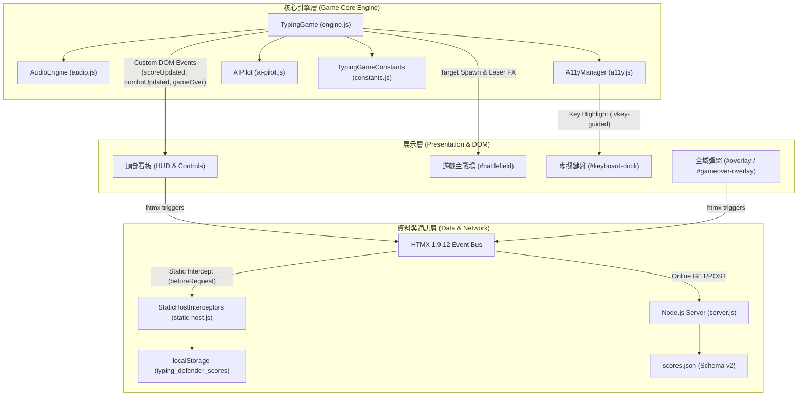
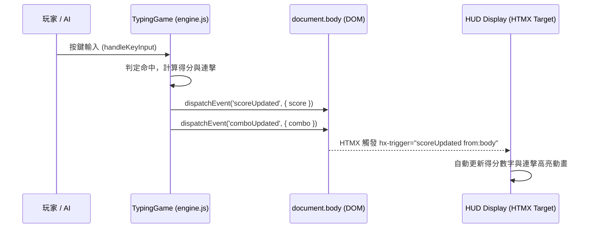

# OpenSpec Design: 系統分層架構與模組設計 (Architecture)

---

### 1. 系統架構拓撲 (System Architecture)

專案採用 **分層事件驅動架構 (Layered Event-Driven Architecture)**，模組間遵循單向資料流與弱耦合通訊：



---

### 2. 模組職責與邊界 (Module Responsibilities)

所有模組位於 `game/` 目錄，採用 **自執行函式 (IIFE)** 封裝，支援瀏覽器全域掛載與 Node.js `module.exports` 雙相容模式：

| 模組檔案 | 導出名稱 | 職責與邊界 |
| :--- | :--- | :--- |
| **`game/constants.js`** | `window.TypingGameConstants` | 定義不可變常數：字元集（英數、符號、大小寫）、難度係數矩陣、AI 駕駛三階參數、全鍵盤 60 鍵鍵位座標與符號標註字典。 |
| **`game/audio.js`** | `window.TypingGameAudio` | 基於 Web Audio API 合成即時音效：射擊音、目標爆破、連擊升調、EMP 全域核彈震盪音、防線突破警報、護盾吸收音。嚴禁讀取外部音訊檔。 |
| **`game/a11y.js`** | `window.TypingGameA11y` | 管理長輩與無障礙功能：強制切換 `body.a11y-mode`、同步雙按鈕狀態、管理「開局三寶」（3 免死護盾、3 初始核彈、急迫字元虛擬鍵盤指引燈）。 |
| **`game/ai-pilot.js`** | `window.TypingGamePilot` | 自主神經輔助駕駛：負責天際目標掃描、危險距離（Y軸深度）威脅度評估、依照模型等級（Rookie/Veteran/God）模擬人類延遲與按鍵射擊，危急時自動啟動大招。 |
| **`game/static-host.js`** | `window.TypingGameStaticHost` | 雙模運行環境偵測與 HTMX 請求攔截器：在靜態環境（GitHub Pages / `file://`）攔截 `/api/leaderboard` 與 `/api/score`，接管 Client-Side 本地儲存與 HTML 片段即時渲染。 |
| **`game/engine.js`** | `window.TypingGameEngine` | 主戰鬥引擎：管理主遊戲狀態（`isPlaying`, `health`, `score`, `combo`）、`requestAnimationFrame` 物理掉落迴圈、`SpawnTimer` 自排程生成、按鍵擊中判定、雷射光束 SVG 繪製。 |
| **`game.js`** | 根啟動腳本 | 進入點：負責模組依賴裝配、判定 `document.readyState` 安全啟動遊戲實體，並解析 URL 參數（如截圖模式）。 |

---

### 3. 事件驅動通訊契約 (Event-Driven Communication)

遊戲引擎與 UI 解耦，核心數據變更**不直接操作特定 DOM 內容**，而是向 `document.body` 發送標準自定義事件，交由 HTMX 自動 swap 渲染：



* **自定義事件清單**：
  1. `scoreUpdated`：得分變更時發送，驅動 `#score-display`。
  2. `comboUpdated`：連擊數增減或歸零時發送，驅動 `#combo-display`。
  3. `statusUpdated`：遊戲狀態切換（準備就緒 / 作戰中 / 系統過載）時發送，驅動 `#status-display`。
  4. `gameOver`：生命值扣至 0 時發送，攜帶結算統計數據，觸發 `#gameover-overlay` 載入結算卡片。

---

### 4. 啟動與生命週期 (Lifecycle & Bootstrapping)

為防範瀏覽器非同步載入或 PWA Service Worker 快取造成的 `DOMContentLoaded` 遺漏，啟動邏輯必須嚴格遵循就緒檢查防護：

```javascript
// game.js 啟動標準樣式
const boot = () => {
    if (!window.game && typeof TypingGame === 'function') {
        window.game = new TypingGame();
    }
    if (typeof initStaticHostInterceptors === 'function') {
        initStaticHostInterceptors();
    }
};

if (document.readyState === 'loading') {
    document.addEventListener('DOMContentLoaded', boot);
} else {
    // 若文檔已處於 interactive 或 complete，立即同步執行
    boot();
}
```
