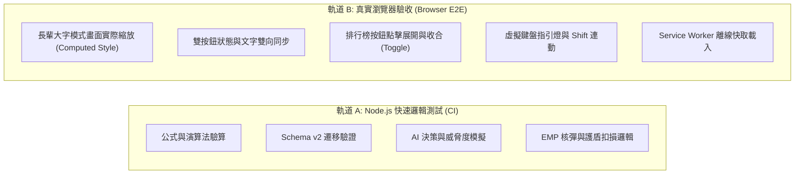

# OpenSpec Design: 驗收測試規範與準則 (E2E Acceptance Standard)

> [!CAUTION]
> **警惕假性全綠測試 (Mock Blind Spot)**：
> 在 Node.js 環境中執行的單元測試僅能驗證演算法與內部變數狀態，**不能作為前端 UI 正常運作的充分證據**。
> 所有交付物必須通過以下雙軌驗收標準，才准許合併或發布。

---

### 1. 雙軌驗收架構 (Dual-Track Acceptance Framework)



---

### 2. 人類工程師驗收劇本 (Gherkin Scenarios)

#### 劇本一：長輩無障礙大字雙按鈕連動與樣式生效
```gherkin
Feature: 長輩無障礙大字模式開關
  Scenario: 玩家在開始視窗點擊大字模式
    Given 遊戲處於首頁說明視窗 (#overlay 顯示中)
    And document.body 未帶有 "a11y-mode" class
    When 玩家點擊 "#modal-a11y-toggle-btn"
    Then document.body 必須包含 class "a11y-mode"
    And "#modal-a11y-label" 文字必須為 "開啟"
    And 頂部 HUD 的 "#a11y-status-label" 文字必須同步變更為 "開啟"
    And "#modal-a11y-toggle-btn" 與 "#a11y-toggle-btn" 必須皆獲得 ".active" class 與金黃色高亮發光
    And 說明文字 ".instructions p" 的計算字級 (computed font-size) 必須大於 16px

  Scenario: 遊戲進行中在頂部 HUD 關閉大字模式
    Given 遊戲正在進行中，且處於大字模式
    When 玩家點擊頂部 HUD 的 "#a11y-toggle-btn"
    Then document.body 必須立即移除 class "a11y-mode"
    And 兩處按鈕文字必須同步變為 "關閉"
    And 兩處按鈕的 ".active" class 必須被移除
```

#### 劇本二：查看英雄榜展開與收合 (Toggle)
```gherkin
Feature: 開始視窗查看英雄榜
  Scenario: 玩家在靜態部署環境點擊查看英雄榜
    Given 頁面運行於 GitHub Pages (hostname 以 "github.io" 結尾) 或 file:// 協議
    And "#start-leaderboard-box" 內容為空
    When 玩家點擊 "#view-leaderboard-btn"
    Then 不得向伺服器發送導致 404 的網路請求
    And "#start-leaderboard-box" 必須渲染出帶有 ".leaderboard-table" 的前十強表格
    And 表格內容必須包含呼號、得分、連擊與命中率

  Scenario: 玩家再次點擊查看英雄榜進行收合
    Given "#start-leaderboard-box" 已經展開顯示排行榜
    When 玩家再次點擊 "#view-leaderboard-btn"
    Then "#start-leaderboard-box" 必須立即隱藏 (display: none) 或清空內容，避免首頁過度冗長
```

#### 劇本三：長輩新手三寶守護
```gherkin
Feature: 無障礙模式長輩新手三大寶物
  Scenario: 以大字模式開始遊戲
    Given 玩家已開啟長輩無障礙大字模式
    When 點擊「🕹️ 親自參戰」開始新遊戲
    Then 初始 EMP 核彈數必須為 3 (三個炸彈槽全部填滿閃電圖示 ⚡)
    And 初始護盾數必須為 3 (HUD 顯示 "🛡️ 3")
    When 目標字元墜落觸底突破防線
    Then 生命值 HP 必須保持 100% (不扣血)
    And 護盾數必須自動扣減為 "🛡️ 2"
    And 虛擬鍵盤上最危急的目標鍵必須亮起青色霓虹指引燈 (.vkey-guided)
```

#### 劇本四：AI 副駕駛即時接管與大招救急
```gherkin
Feature: AI 自動副駕駛
  Scenario: 切換 AI 駕駛模式
    Given 遊戲正在進行中，玩家手動操作
    When 玩家按下鍵盤 [Tab] 鍵或點擊 "#ai-toggle-btn"
    Then AI 副駕駛狀態必須切換為 "運作中"
    And 底部 AI 雷達跑馬燈開始動態顯示鎖定目標與倒數秒數
    And 玩家放開鍵盤，AI 必須自主辨識字元並自動擊發消滅目標
  
  Scenario: 危急情境自動啟動核彈
    Given AI 副駕駛運作中，且持有至少 1 枚 EMP 核彈
    When 畫面上出現剩餘降落秒數 < 0.8 秒的高危險威脅目標
    Then AI 必須自動引爆 EMP 核彈殲滅全螢幕目標
    And 雷達顯示 "⚡ 緊急狀況：AI 啟動 EMP 核彈！"
```

---

### 3. 發布前人類工程師檢核清單 (Pre-Release Checklist)

在任何程式碼變更提交前，人類工程師必須逐項打勾確認：

- [ ] **無多餘依賴**：`package.json` 中無新增未經授權的第三方 npm 庫。
- [ ] **CSS 契約一致**：檢驗所有新寫的 JS classList 操作，均已在 `style.css` 存在對應宣告。
- [ ] **HTMX 規範合規**：未直接讀取 `evt.detail.path`，一律使用 `evt.detail.requestConfig?.path`。
- [ ] **雙環境無阻**：在本機 `npm start` (localhost:3000) 與直接打開 `index.html` (靜態模式) 均能順暢遊玩與檢視排行榜。
- [ ] **控制台零報錯**：遊戲全程（開始、射擊、核彈、結束、排行榜）瀏覽器 DevTools Console 均無任何 Uncaught Error 或 404 報錯。
