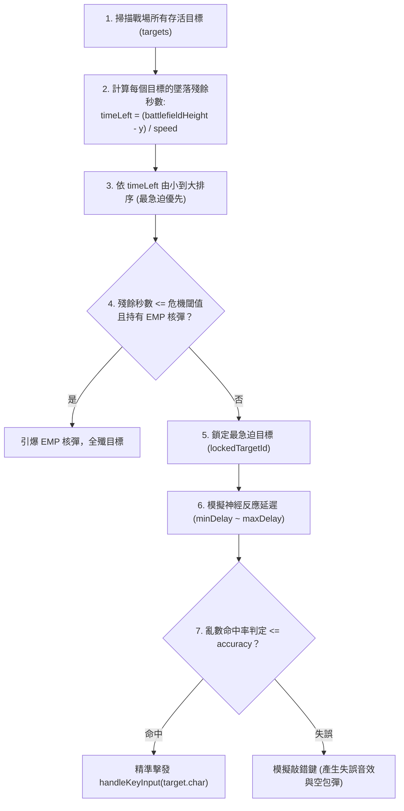

# OpenSpec Domain: AI 副駕駛系統規範 (AI Co-Pilot System)

---

### 1. 系統定位 (System Role)
AI 副駕駛為玩家提供即時的輔助作戰或全自主託管。玩家可隨時按下 **[Tab]** 鍵交接鍵盤主控權，觀察 AI 進行高頻打擊，或在疲勞時交由 AI 守衛防線。

---

### 2. 三階模型參數矩陣 (AI Model Hierarchy Matrix)

系統內建 3 種階層的自主駕駛模型，其反應曲線與精準度各異：

| 模型階層 | 代碼 (`modelKey`) | 顯示名稱 | 反應延遲區間 | 命中率 | 大招使用策略 |
| :--- | :--- | :--- | :--- | :--- | :--- |
| **初級 (ROOKIE)** | `rookie` | 🟢 初級 (ROOKIE) | $220\text{ms} \sim 350\text{ms}$ | **88%** | 剩餘時間 $< 0.5\text{s}$ 且有核彈時才會引爆 |
| **老兵 (PRO)** | `veteran` | 🟡 老兵 (PRO) | $90\text{ms} \sim 150\text{ms}$ | **98%** | 剩餘時間 $< 0.8\text{s}$ 且有核彈時觸發 |
| **天神 (GOD)** | `god` | 🔴 AGI (GOD) | $30\text{ms} \sim 60\text{ms}$ | **100%** | 極限計算，威脅目標 $\ge 2$ 且殘餘秒數 $< 1.0\text{s}$ 時引爆 |

---

### 3. 威脅度優先評估演算法 (Threat Evaluation Algorithm)

AI 決策迴圈以動態週期（依當前模型延遲決定）執行 `aiThinkAndAct()`：

---

### 4. AI 戰績辨識與呼號規範 (AI Leaderboard Callsign)

為維護人類玩家英雄榜的公正性，凡在對局中有開啟過 AI 副駕駛接管的戰局：
1. **呼號自動標記**：
   * 預設呼號依模型指定：`AI_ROOKIE` / `AI_CYBER_PRO` / `AGI_GOD_PILOT`。
2. **排行榜視覺徽章**：
   * 結算卡片與英雄榜名單必須標註 `[🤖 AI 副駕駛]` 專屬徽章。
   * 資料庫紀錄中註記 `is_ai: true`，防止人類玩家與純機器人競賽混淆。
