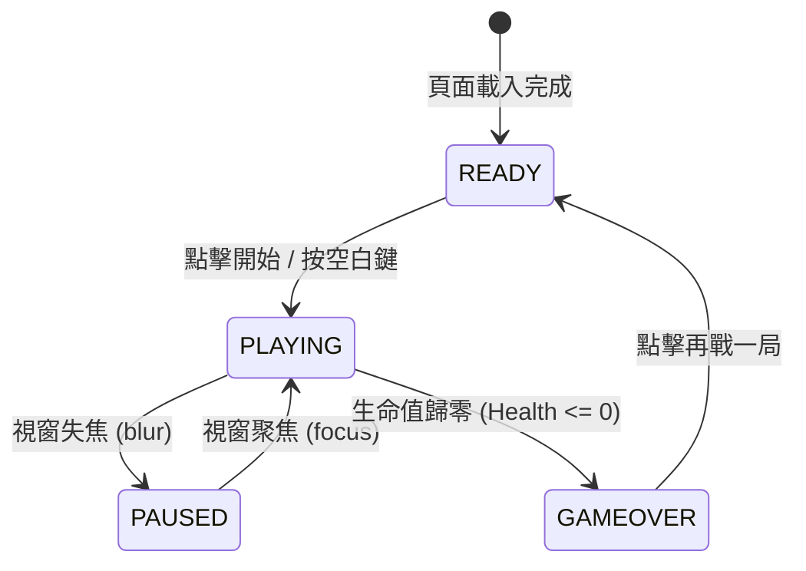

# OpenSpec Domain: 戰鬥引擎與核心玩法 (Game Core Engine)

---

### 1. 遊戲狀態機 (Game State Machine)

遊戲運作遵循明確的單向狀態機轉換：



---

### 2. 生成排程器規格 (SpawnTimer Specification)

#### 2.1 嚴格自排程規範
* **禁止使用 `setInterval`**：為防止瀏覽器分頁切換至後台時定時器積壓，導致切回前台時瞬間生成大量目標，目標生成**必須使用 `setTimeout` 進行遞迴自排程**。
* **自排程演算法**：
  每次生成目標並將其推入 `targets` 陣列後，動態計算下一次生成的毫秒間隔：
  $$\text{SpawnDelay} = \max\left(\text{MIN\_DELAY},\; \text{BASE\_DELAY} - (\text{Score} \times \text{DECAY\_FACTOR})\right)$$
  * 當前基準常數：
    * $\text{BASE\_DELAY} = 1500\text{ ms}$
    * $\text{MIN\_DELAY} = 450\text{ ms}$
    * $\text{DECAY\_FACTOR} = 0.8$
    * 在長輩無障礙模式下，$\text{SpawnDelay}$ 自動加成 $1.25\times$，提供更從容的反應時間。

---

### 3. 字元匹配與重複字母優先級 (Character Matching & Threat Priority)

#### 3.1 區分大小寫與特殊符號
* 系統支援全英文字母（小寫 a-z、大寫 A-Z）、數字（0-9）與鍵盤符號（`!@#$%-+=[]{}();:'",./?\|~`）。
* 目標字元比對必須是精確的 `char === pressedKey`（區分大小寫）。

#### 3.2 同字母多目標的「距底危急度優先權」
當畫面上同時存在多個相同字母時（例如有兩個 `a` 正在墜落）：
* **禁止隨機射擊**。
* **必須優先消滅 Y 軸座標最大（即最接近戰場底部、危險度最高）的目標**。
* 演算法：
  ```javascript
  const matchedTargets = this.targets.filter(t => t.char === key);
  if (matchedTargets.length > 0) {
      // 依 y 座標由大至小排序，消滅第 0 個
      matchedTargets.sort((a, b) => b.y - a.y);
      const targetToDestroy = matchedTargets[0];
      this.eliminateTarget(targetToDestroy);
  }
  ```

---

### 4. EMP 全域核彈與充能機制 (EMP Bomb Specification)

* **充能條件**：玩家每累積滿 **60 分**，自動充能 1 枚 EMP 核彈（以音效提示與 HUD 閃電槽高亮）。
* **攜帶上限**：一般模式上限為 **2 枚**；長輩無障礙模式上限為 **3 枚**。
* **觸發方式**：
  * 人類手動：按下鍵盤 **[空白鍵 (Space)]**。
  * AI 自動：當墜落危急目標倒數小於閾值且持有核彈時自動觸發。
* **引爆效果**：
  * 瞬間清除畫面上所有正在墜落的目標。
  * 獲得消滅目標的全部累加分數，且**連擊數不中斷**。
  * 螢幕產生全域青白色 EMP 衝擊波光效（持續 400ms）。
  * 若核彈數為 0，按下空白鍵必須安全防護（不得拋錯、不得清空畫面）。
